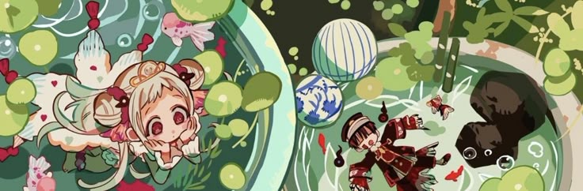

  

<h2 align="center">🍁 shomy 🍂</h2>

  Hi! I'm Shomy, a Musician & Developer. 
  I sometimes make music and games, too.  
  Currently contributing to various projects like 
  <a href="https://github.com/hummingbird-me">Kitsu</a>, 
  <a href="https://github.com/R0rt1z2/kaeru">kaeru</a>, and more...  
  <a href="https://shomy.bsky.social">BlueSky</a> • 
  <a href="https://kitsu.app/users/shomy">Kitsu</a> • 
  <a href="https://shomy.is-a.dev/">Blog</a>

## 🛠️ Tools & languages

* [NixOS](https://nixos.org/)
* [Godot Engine](https://godotengine.org/) 
* [Aseprite](https://www.aseprite.org/)  

- GDScript (For the Godot Engine)
- C/C++
- Rust
- Python

## 📜 Projects

<table>
  <tr>
    <td valign="top" width="50%">
      <strong><a href="https://github.com/shomykohai/quest-system">quest-system</a></strong> 
      📜 A simple and extensible quest system for Godot 4.
    </td>
    <td valign="top" width="50%">
      <strong><a href="https://github.com/shomykohai/penumbra">penumbra</a></strong> 
      🌘 A Mediatek Flash Tool library and TUI written in Rust.
    </td>
  </tr>
  <tr>
    <td valign="top">
      <strong><a href="https://github.com/shomykohai/godot-keyring">godot-keyring</a></strong> 
      🔑 A godot gdextension to interact with the OS keyring.
    </td>
    <td valign="top">
      <strong><a href="https://github.com/shomykohai/haruka">haruka</a></strong> 
      ⚗️ Patches for Android libraries
    </td>
  </tr>
  <tr>
    <td valign="top">
      <strong><a href="https://github.com/shomykohai/jekyll-maple">jekyll-maple</a></strong> 
      🍄 A cozy and dreamy jekyll theme gem, inspired by autumn and fairies.
    </td>
    <td valign="top">
      <strong><a href="https://github.com/shomykohai/askitsu">askitsu</a></strong> 
      🦊 An async API wrapper for Kitsu.io 
    </td>
  </tr>
</table>
